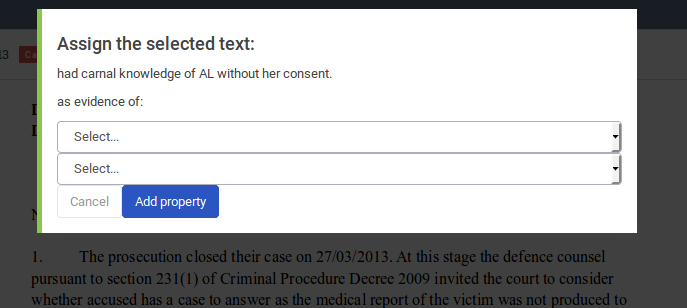
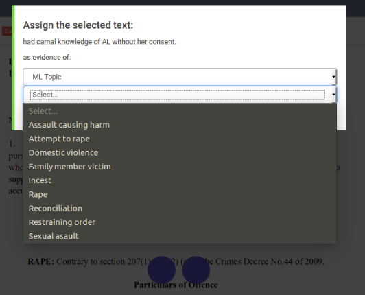
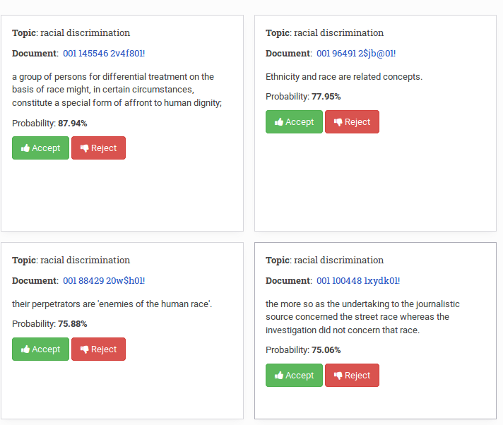
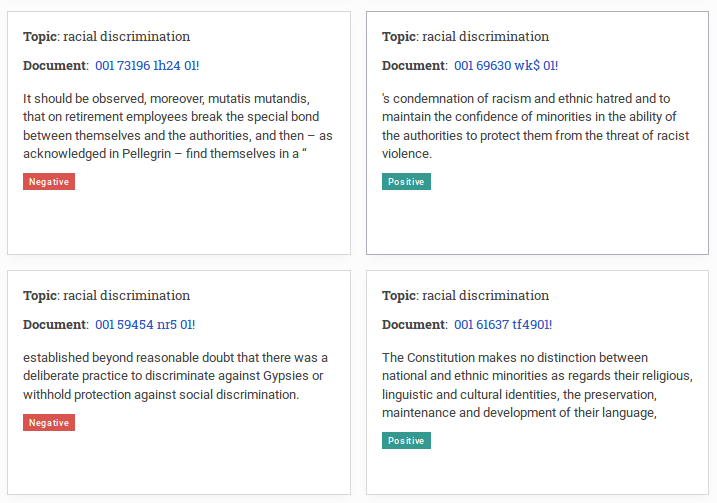

### Getting Started

In summary, these are the steps for using machine learning for document classification:

1. Upload you documents.
2. Create and assign a basic template to the uploaded documents with at least a thesaurus property. The items in this thesaurus will be used as labels (or categories) for classification.
3. Find and tag one sentence in one document that will be used a model for an initial sweep of the documents to locate more evidence sentences (sentence encoder step).
4. Accept and reject some of these initial suggestions to have some ground for training the classifier.
5. Train the classifier (convolutional neural network step).
6. Run another sweep on the documents, this time it will be using the convolutional neural network instead of the sentence encoder).
7. Repeat steps 4 to 6 until the resulting suggestions look coherent.
8. Run the automatic classification on the whole database to have all the documents processed and tagged. (this step is not implemented yet).

A note on the two classifiers being used:

- The sentence encoder step is based in Google's Universal Sentence Encoder. This algorithm can compare two sentences to find out similarities in word semantics and gramatical structure. The advantage of this approach is that if the appropiate example sentence is provided, it can find very relevant suggestions even with only one example sentence.

The drawback is that it can only compare two sentences, so it won't generalize the concept and remove edge cases. This is the default classifier, once we hit the "Train" button, the convolutional neural network classifier takes control and the sentence enconder classifier is never used again for this particular category.

- The convoloutional neural network will use all the accepted and rejected sentences as training data. The adavange of this classifier is that it generalizes the classification concept, removing edge cases and emphasizing in reppeating patterns. This classifier is faster than the sentence encoder one.

The drawback is inherent to all neural networks: training can go wrong and run into some of the well known problems of neural networks (overfitting, castrophic forgetting, etc). At this stage we don't have contingency measures implemented to fix these problems (apart from retraining with more data), but have some ideas to be implemented in our roadmap so users can easily overcome these issues.

## Detailed instructions

After uploading a collection of documents to Uwazi, create a metadata scheme with the relevant document properties such as the topic, related organizations and institutions, information about persons, and results or conclusions of discussions. Take a look at the [Uwazi user guide](https://github.com/huridocs/uwazi/wiki) for more information. 

The next step is to show the algorithm what is important for you:

​	(1) Search for a category by keywords and open a corresponding document

​	(2) Mark a sentence that is relevant to categorize a document.
​	     *had carnal knowledge of XX without her consent* indicates the topic *rape*.

​	(3) Click *Add as evidence*

​	(4) Choose the category and the specific value the sentence is an evidence of.
​	Your predefined list of categories will pop up.

Congratulations, you added your first sentence to the training data.

Go to the machine learning panel  

The machine learning panel shows you for each category the provided sentences.
On the right side panel you can filter per category.

Select a category and click the green *Toggle Predict* button. Be aware, that you need at least one sample sentence as the underlying algorithm is looking for similar phrases within other documents of the collection. So one by one, documents are processed and if semantically similar content is found, suggestions, sorted by probability pop up.

Be patient! The processing time per documents is (currently) at about 3s. Especially for topics that are rare within the collection, it might take some time to find related content.

​			

The probability indicates how similar the suggestions are to the provided sample sentences for this category. The higher, the better.

The underlying approach is the Universal Sentence Encoder. [Here](https://www.tensorflow.org/hub/modules/google/universal-sentence-encoder/1) you can find out more on how it works.

Some suggestions might not fit perfectly the category you are looking. However, you can teach a classifier what is important for a category by accepting (green button) correct suggestions and rejecting (red button) wrong suggestions. You will see, that the suggestion turn into positive and negative sample sentence. 

To update the algorithm press the *Retrain* button next to the corresponding category. With *Toggle Predict'* new suggestions are obtained within the collection of documents.

Please be aware that to train a good classifier, you need positive and negative sample sentences. Best is to have at least five of both categories when pressing *Retrain* for the first time. And don't worry if the first results are not exactly what you are looking for. The sentence classifier is still learning. 

Click predict again to get sentence suggestions from other documents

Repeat the process of accepting and rejecting evidences to further refine the classifier and obtain better samples.

Accepting, also, automatically adds the specific category to the document the suggestion belongs to. 

### Want more details?

Find out about the Universal Sentence Encoder and the Convolutional Neural Network.

[What are Convolutional Neural Network and how to use them for Sentence Classification?](...)

Daniel Cer, Yinfei Yang, Sheng-yi Kong, Nan Hua, Nicole Limtiaco, Rhomni St. John, Noah Constant, Mario Guajardo-Céspedes, Steve Yuan, Chris Tar, Yun-Hsuan Sung, Brian Strope, Ray Kurzweil.
[Universal Sentence Encoder](https://arxiv.org/abs/1803.11175). arXiv:1803.11175, 2018.

Yoon Kim. [Convolutional Neural Networks for Sentence Classification](https://arxiv.org/abs/1408.5882). arXiv:1408.5882, 2014.
