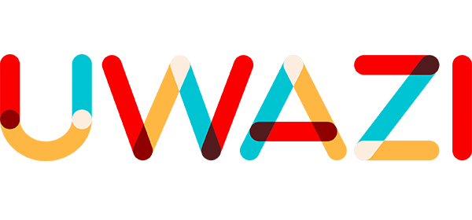

In Swahili, Uwazi means “openness.” HURIDOCS designed Uwazi to **make human rights information more open and accessible to the defenders who need it**.

Uwazi is a web-based platform to analyze and publish large collections of documents. It's flexible metadata scheme is adaptable to any type of collection or research purpose. Each document can be referenced and connected to other documents or even persons or events. Additional highlighting and tagging of relevant information makes Uwazi a powerful tool for organizing collection and to make their content accessible.

# 

### Machine-assisted extraction of metadata

With limited resources, human rights defenders connect information from different sources in order to tell 
the story of victims, reveal patterns of discrimination, and hold governments accountable.  Machine learning can reduce the tedious manual work involved in this process by learning how a human rights defenders classify documents and which information is relevant for them.

Integrating a machine-assisted extraction of metadata into Uwazi makes this transformative technology accessible to human rights organisations.

##### Goals

We strive to effectively support human rights defenders by building a system that connects human intuition and expert knowledge with machine intelligence. To ensure that emerging machine learning models are beneficial we aim for:

- *Transparency* - about the data used to train an algorithm

- *Interactiveness* - users are in power to accept but also reject suggestions, to keep the feedback loop open and continuously improve the algorithm

### [Getting Started](./GettingStarted.md)

